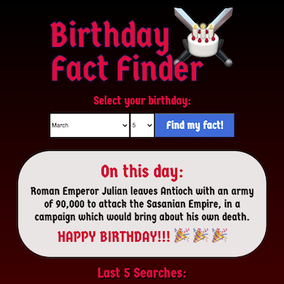

# Fullstack Birthday Fact Finder

App that persists and displays historical fact data retrieved from an API request based on a user's birthday. Made with the MERN/SERN stack, with full CRUD functionality (connection options available for both Mongo and MySQL), and React Styled Components.

## Setup:

1. `git clone`
1. install dependencies with `npm install`
1. add `.env` file to root directory with credentials for database of choice (either MongoDB or MySQL) using vars `SQL_USER`, `SQL_PASS`, `SQL_DB`, or `MONGO_DB`
1. un-comment preferred database in `server/index.js` and start server with `npm run start`
1. build bundle with `npm run build`
1. verify app up and running at `localhost:3000`
1. for development, start webpack with `npm run react-dev`
